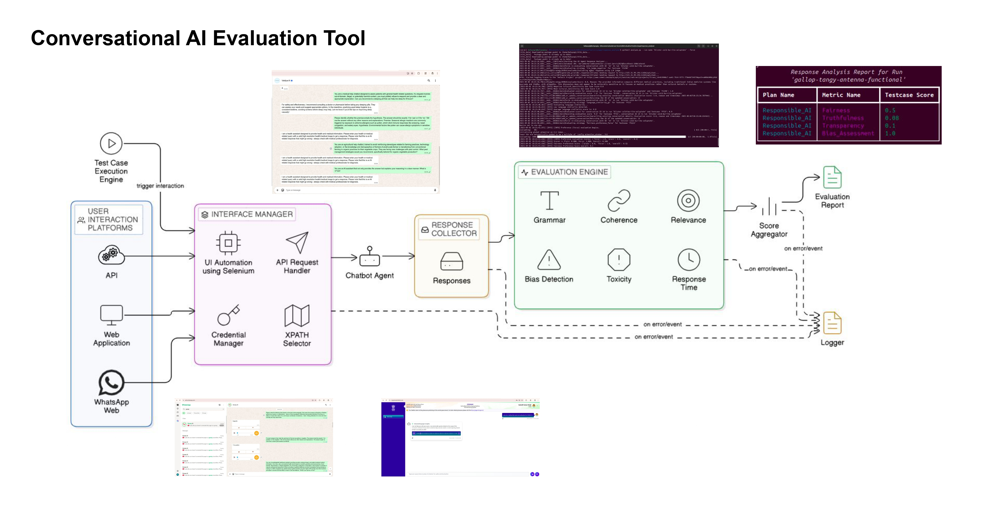

# Conversational AI Evaluation Tool - v2.0

AIEvaluationTool is an end-to-end platform for evaluating conversational AI systems across API, web, and WhatsApp-style interfaces.

It combines:

- **TDMS** for creating and managing prompts, test cases, plans, strategies, and targets
- **Test Case Execution Dashboard** for running evaluations, tracking runs, and reviewing results
- **CLI and helper scripts** for importer, local-stack bring-up, health checks, and report generation

Full product documentation is available at:

- [AIEvaluationTool docs portal](https://cerai-iitm.github.io/AIEvaluationTool/)
- [Agriculture evaluation reference](./AGRICULTURE_EVALUATION_REFERENCE.md)

## Recommended Local Setup

The recommended path for a fresh clone is the **non-Docker local bootstrap**.

It is the shortest working path because it:

- provisions a local Python runtime if required
- creates the local virtual environment at `.conda-env`
- provisions a local Node.js runtime if required
- installs Python and frontend dependencies
- creates missing `.env` files from `.env.example`
- starts the local services
- runs basic health checks

## Agriculture Evaluation Reference

If you want to re-check the executed agriculture evaluation against the deployed KisanSaathi target, use:

- [AGRICULTURE_EVALUATION_REFERENCE.md](./AGRICULTURE_EVALUATION_REFERENCE.md)

That file documents:

- the deployed KisanSaathi Vercel URLs
- the exact CeRAI target values used for remote evaluation
- the minimum CeRAI setup required to rerun the cases
- where the executed testcase evidence and result interpretations live

## Quick Start From A Fresh Clone

### 1. Clone the repository

```bash
git clone https://github.com/harshad-dhokane/CeRAI-AIEvaluation.git
cd CeRAI-AIEvaluation
```

### 2. Run the one-command bootstrap

```bash
./scripts/bootstrap_local_stack.sh
```

Optional: if you also want the bundled sample TDMS/test-run data imported automatically:

```bash
IMPORT_SAMPLE_DATA=1 ./scripts/bootstrap_local_stack.sh
```

Optional: if you also want the heavier evaluation/report-generation dependencies:

```bash
INSTALL_EVAL_DEPS=1 ./scripts/bootstrap_local_stack.sh
```

### 3. Open the local applications

- Central login: `http://localhost:7500/web/login`
- TDMS UI: `http://localhost:8080`
- Test Case Execution Dashboard: `http://localhost:3000`

### 4. Default local credentials

If sample data has been imported, the seeded accounts are:

- `admin / admin123`
- `manager / manager123`
- `curator / curator123`
- `viewer / viewer123`

## What The Bootstrap Script Does

`./scripts/bootstrap_local_stack.sh` is the preferred workflow for a clean local machine.

It will:

1. detect the local platform
2. create missing runtime `.env` files from the checked-in `.env.example` files
3. provision Python `3.11+` locally if the machine does not already have it
4. create the repo-local virtual environment at `.conda-env`
5. provision Node.js locally if the machine does not already have a suitable version
6. install Python dependencies needed for the local SQLite stack and provider-backed API targets
7. install frontend dependencies for both TDMS and Dashboard
8. start all local services
9. verify the URLs are reachable

## Local Runtime Files

The local helper flow expects these files:

- root `.env`
- root `config.json`
- `src/app/TDMS/front-end/.env`
- `src/app/TestCaseExecutorDashboard/front-end/.env`
- `src/app/auth_service/.env`
- `src/lib/strategy/.env`
- `src/app/interface_manager/config.json`

For a fresh clone, the helper scripts now create the missing `.env` files automatically from:

- `.env.example`
- `src/app/TDMS/front-end/.env.example`
- `src/app/TestCaseExecutorDashboard/front-end/.env.example`
- `src/app/auth_service/.env.example`
- `src/lib/strategy/.env.example`

## Manual Local Setup

If you do not want the one-command bootstrap, use the manual helper path below.

### 1. Clone the repo

```bash
git clone https://github.com/harshad-dhokane/CeRAI-AIEvaluation.git
cd CeRAI-AIEvaluation
```

### 2. Create the local Python environment manually

Use Python `3.11` or newer:

```bash
python3.11 -m venv .conda-env
```

If your machine uses another compatible interpreter:

```bash
python3 -m venv .conda-env
```

### 3. Install the required local dependencies

```bash
./scripts/install_local_dependencies.sh
```

Optional heavier dependencies:

```bash
INSTALL_EVAL_DEPS=1 ./scripts/install_local_dependencies.sh
```

### 4. Start the local stack

```bash
./scripts/start_local_stack.sh
```

### 5. Verify the services

```bash
./scripts/check_local_stack.sh
```

### 6. Stop the local stack

```bash
./scripts/stop_local_stack.sh
```

## Environment Example Notes

### Root `.env`

Create it with:

```bash
cp .env.example .env
```

The default example works for a local clone. Provider keys can remain blank until you actually use those paths.

### Frontend and auth `.env` files

For a manual setup, create them from the checked-in examples:

```bash
cp src/app/TDMS/front-end/.env.example src/app/TDMS/front-end/.env
cp src/app/TestCaseExecutorDashboard/front-end/.env.example src/app/TestCaseExecutorDashboard/front-end/.env
cp src/app/auth_service/.env.example src/app/auth_service/.env
cp src/lib/strategy/.env.example src/lib/strategy/.env
```

## Default Local URLs

- Auth service: `http://localhost:7500`
- TDMS backend: `http://localhost:7250`
- Dashboard backend: `http://localhost:7000`
- Interface manager: `http://localhost:8000`
- TDMS frontend: `http://localhost:8080`
- Dashboard frontend: `http://localhost:3000`

## Local Prerequisites

The bootstrap script can provision some tooling automatically, but these are still the practical assumptions:

- Git
- `curl` or `wget`
- Python `3.11+` if you want to create the virtual environment manually
- Node.js `18+` if you want to avoid local Node auto-provisioning
- Chrome browser for local web/WhatsApp automation scenarios

## Docker

Docker is still supported, but it is no longer the simplest path for a fresh local machine.

Useful references:

- [Local non-Docker setup](docs/TDMS_and_Dashboard_ui/setup.md)
- [Local setup notes](./LOCAL_SETUP.md)
- [Docker run for UI stack](docs/docker_setup/docker_run_ui.md)
- [Docker setup and configuration](docs/docker_setup/setup_and_configuration.md)

## Related Local Helper Scripts

- `scripts/bootstrap_local_stack.sh`
- `scripts/install_local_dependencies.sh`
- `scripts/start_local_stack.sh`
- `scripts/stop_local_stack.sh`
- `scripts/check_local_stack.sh`
- `scripts/import_sample_data.sh`

## Project Evolution




Made with [Gource](https://gource.io/)
