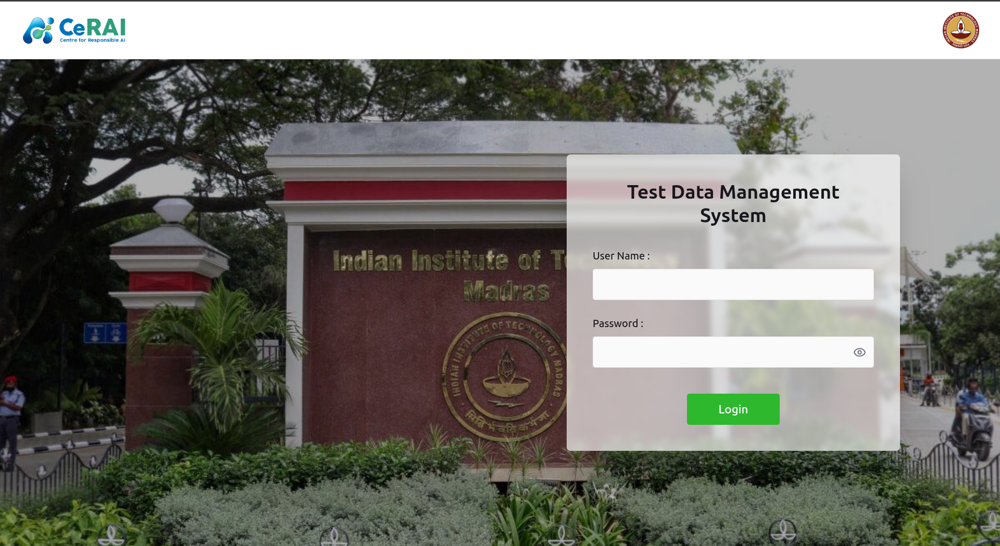

# TDMS Dashboard User Manual

Use this page to understand the TDMS landing dashboard and where each option is located.

## Screen Purpose

The TDMS dashboard is the entry point for managing evaluation data entities such as test cases, targets, prompts, plans, and metrics.

## Main Layout

### Left Sidebar

- `Home`: opens the Test Run Dashboard UI (visible for `admin` and `manager` roles)
- `Test Data`: opens TDMS dashboard (`/dashboard`)
- `User's List`: user management page (`/users`) (admin only)
- `Log out`: clears session and redirects to central login

### Center Cards

Each card represents one TDMS module:

- `Test cases`
- `Targets`
- `Domains`
- `Strategies`
- `Languages`
- `Responses`
- `Prompts`
- `LLM Prompts`
- `Test Plans`
- `Metrics`

## Card Options (Where To Click)

For each card, the top-right menu (`three-dot icon`) contains:

- `Open`: navigate to that module page
- `History`: open entity-level activity history dialog (role dependent)

You can also click the card body to open the module directly.

## Typical User Flow From This Screen

1. Open the needed data module from a card.
2. Create or update records.
3. Return to dashboard and open the next module.
4. Use `Home` in sidebar to move to Test Runs dashboard when data preparation is complete.
